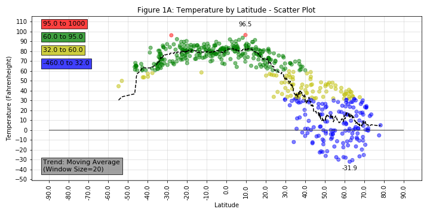
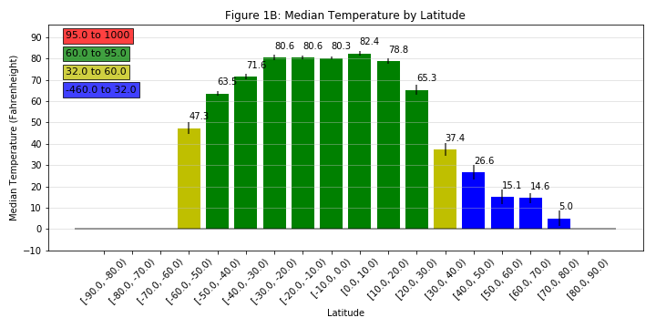
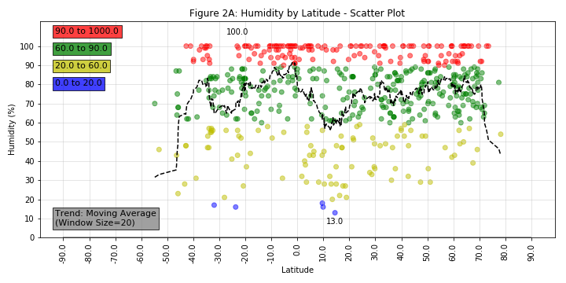
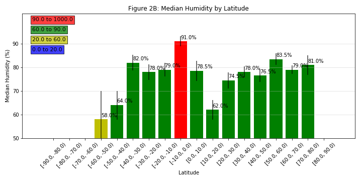
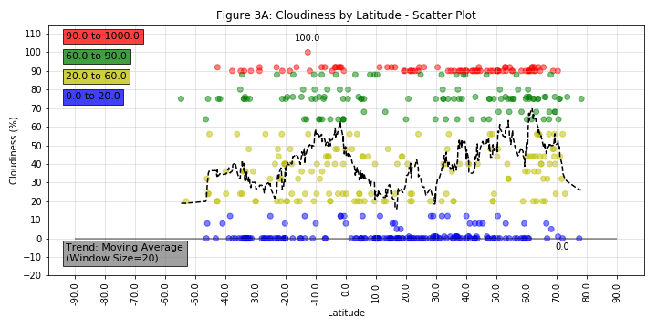
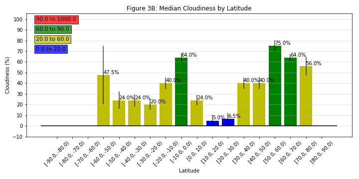
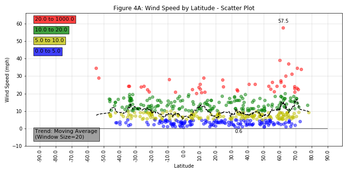
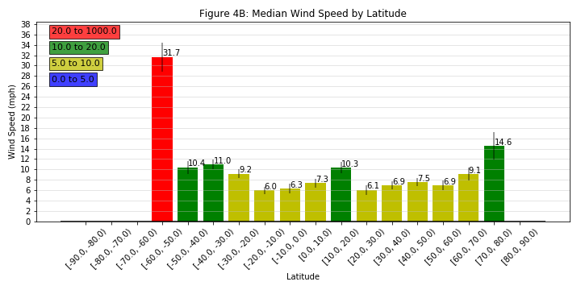

# Weather by Latitude

This application provides an analysis of variation in Weather at various latitudes.

# Technologies Used

* Python, Jupyter Notebook
* Matplotlib
* HTML, CSS, Bootstrap

# Reference

* GitHub: https://github.com/daddyjab/WeatherByLatitude
* Data Exploration and Analysis (Jupyter Notebook): https://github.com/daddyjab/WeatherByLatitude/blob/master/WeatherPy-jb.ipynb
* Visualization: https://daddyjab.github.io/WeatherByLatitude

# Contributions

* Jeffery Brown: Designed and implemented all code for this application.

* Data:
    * Weather data from OpenWeatherApp API: http://api.openweathermap.org/data/2.5/weather
    * Cities near Latitude/Longitude coordinates - CitiPy library: https://pypi.org/project/citipy/

# Summary

* Data from over 500 cities were randomly selected from across the full set of global latitude and longitude areas for which Citipy has data populated.
    * To provide some confidence that the random selection was not clustered in the same global regions, a search grid was defined.  The search grid divided both latitude (-90 to +90 deg) and longitude (-180 to +180 deg) into sections of 7 degrees each, yielding 1431 search points.
    * The `citipy` library was then used to find cities nearest to each latitude/longitude coordinate in the search grid.

* Weather data for these cities was gathered from the OpenWeatherMap API and various weather patterns populated by latitude.
    * Cities for which no weather data was available or which had invalid data (e.g., Humidity > 100%) were dropped from the data.
    * After cleaning, the data was comprised of 529 unique cities and their associated weather data.
* Per-city weather results were generated using scatter plots, and median weather results were generated using bar charts.  For each plot, marker color was varied based upon the value of the weather characteristic being plotted.
    * For the scatter plots, a moving average trend line (window size = 20 samples) was added to highlight and pattern of variation of the mean by latitude
    * For the bar plots, each bar represents the median weather characteristic for a particular range of latitude.  Error bars based upon the standard erroro of the mean have also been provided.
* The final results were captured in the [Jupyter Notebook](https://github.com/daddyjab/WeatherByLatitude/blob/master/WeatherPy-jb.ipynb) and also were visualized on a [web site](https://daddyjab.github.io/WeatherByLatitude).

# Overall Results

* Temperature shows a clear pattern of variation by latitude, with temperatures increasing near the equator (0 degree latitude) and decreasing near the poles
* Neither Humidity nor Cloudiness show a pattern of variation by latitude
* Wind Speed is relatively uniform across most latitudes, but with relatively higher wind speeds occurring near the poles

## Temperature
|Temperature|Median Temperature|
|-----------|------------------|
| |  |

* Both the moving average trend line scatter plot of per-city temperature by latitude and the bar chart of median temperature by latitude show a clear relationship between temperature and latitude.
* For a specific band of latitude there is less variation in southern latitudes (0 to -90 deg) vs. northern latitudes (0 to +90 deg). A next step that might be useful could be to examine variation temperature in a specific latitude band based upon longitude or other factors, including level of population, industrialization, etc.

## Humidity
|Humidity|Median Humidity|
|--------|---------------|
| |  |

* The plots of both humidity and median humidity both show significant variation in humidity levels across most latitudes, with neither moving average nor median humidity showing a significant pattern by latitude.

## Cloudiness
|Cloudiness|Median Cloudiness|
|----------|-----------------|
| |  |

* The plots of both cloudiness and median cloudiness across most latitudes suggest no significant trend w.r.t. latitude.
* Cloudiness near the equator (~0 to 20 degress latitude) appears to be relatively low vs other areas, but this may be just coincidence, with cloudiness there being different on other days/times of day.  A follow-up study could check the variation in cloudiness for that region over time.

## Wind Speed
|Wind Speed|Median Wind Speed|
|----------|-----------------|
| |  |

* The plots of both wind speed and median wind speed across most latitudes shows moving average and median wind speeds fairly level.  
* An exception to this is relatively higher wind speeds at the poles vs. the equatorial region.
